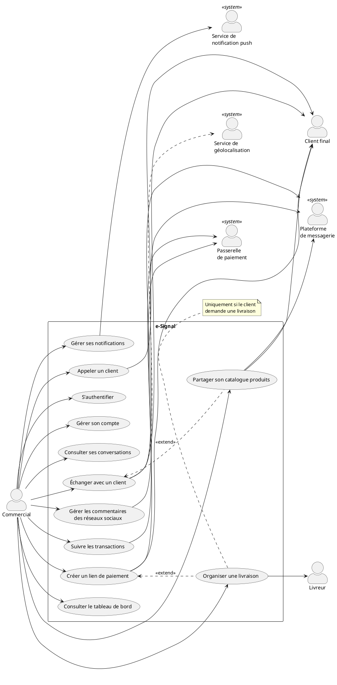
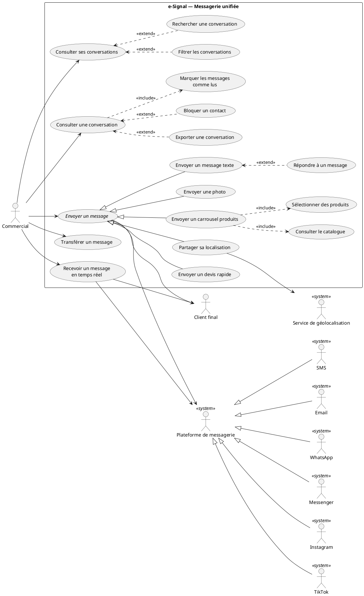
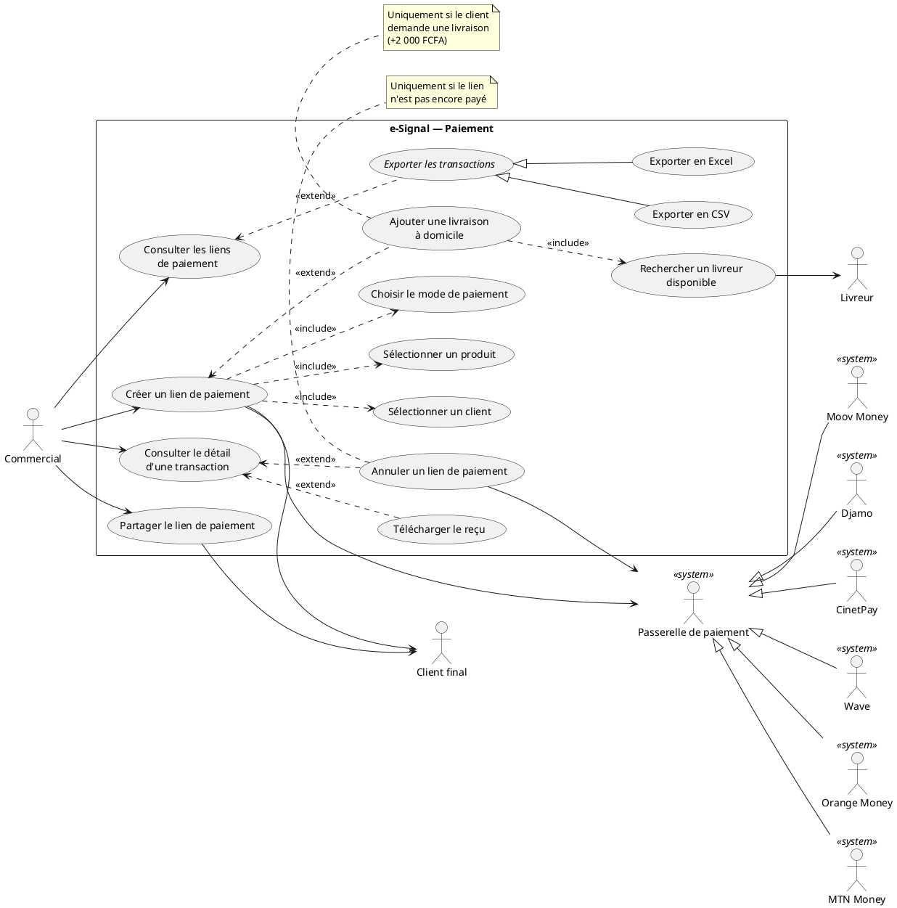
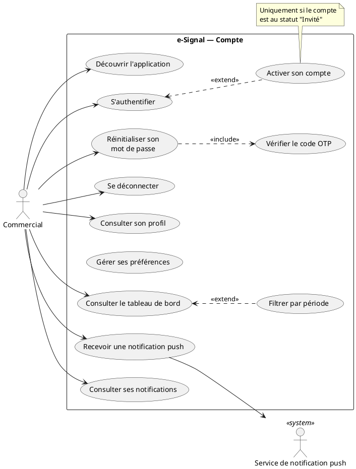

# Dossier d'analyse — Diagramme des cas d'utilisation (DCU)
## Projet e-Signal — Score360 Africa

> Document de travail préparatoire au diagramme des cas d'utilisation UML.
> Conforme aux exigences du cours n°2 « UML : Diagramme des cas d'utilisation ».
> Source : analyse du code source de l'application (branche `feature/retouch`).

---

## 0. Rappel des règles du cours appliquées ici

| Règle du cours | Application dans ce dossier |
|---|---|
| Vision **utilisateur**, pas informatique | Aucun CU ne parle de cache, WebSocket, token, API |
| **Pas** un inventaire exhaustif | § 3 = DCU synthétique (12 CU) ; § 4 = détail par domaine |
| Nom de CU = **verbe à l'infinitif** | « Envoyer un message », « Créer un lien de paiement »… |
| Acteur = entité **externe** au système | § 2, avec justification de la frontière |
| Stick man = humain / classeur « actor » = matériel ou système | Colonne « Représentation » du § 2 |
| Éviter la **décomposition fonctionnelle hiérarchique** | § 5.4 liste les pièges écartés |
| `include` = impératif / `extend` = optionnel | § 5.1 et § 5.2, chaque relation est justifiée |
| Généralisation entre acteurs = seule relation possible | § 2.4 |
| Description textuelle en 3 parties | § 6 (3 CU rédigés au format exact) |

---

## 1. Présentation du système et définition de la frontière

### 1.1 Le système en une phrase

**e-Signal** est une application mobile de **messagerie unifiée** destinée aux PME
ivoiriennes : elle regroupe dans une seule boîte de réception les conversations
issues de tous les canaux de communication du commerçant (WhatsApp, Facebook
Messenger, Instagram, TikTok, SMS, Email), et permet de conclure la vente en
générant des **liens de paiement mobile money** sans quitter la conversation.

### 1.2 Choix de la frontière du système — POINT CRITIQUE

C'est la décision la plus importante de votre diagramme : elle détermine qui est
acteur et qui ne l'est pas. Deux options défendables :

**Option A — RECOMMANDÉE : le système = « Plateforme e-Signal » (application mobile + backend Score360)**

```
┌─ Plateforme e-Signal ─────────────────────┐
│  App mobile Flutter + API ws.score360     │
└───────────────────────────────────────────┘
   ↑ acteurs : Commercial, Client final,
     WhatsApp/Meta, Passerelles de paiement,
     FCM, GPS, Livreur
```
- **Avantage** : correspond au produit livré au client, et c'est ce qu'attend un
  jury (le backend n'est pas un « utilisateur » du produit).
- Le backend Score360 **n'est pas un acteur** (il est dans le système).

**Option B — le système = « Application mobile e-Signal » seule**
- Le **backend / API Score360** devient alors un acteur secondaire de presque
  tous les CU → le diagramme devient répétitif et peu parlant.
- À réserver si votre sujet de stage porte explicitement sur le seul livrable mobile.

➡️ **Tout ce document utilise l'Option A.**

### 1.3 Comparaison avec l'exemple du cours (le DAB)

| DAB (cours) | e-Signal |
|---|---|
| Porteur de carte | Commercial (utilisateur de l'app) |
| Client banque (spécialisation) | Client final (contact) |
| S.I. Banque (système externe) | Plateformes de messagerie (WhatsApp, Meta…) |
| Système d'Autorisation Carte (système externe) | Passerelles de paiement (Wave, Orange Money…) |
| Opérateur de maintenance | *(pas d'équivalent dans le périmètre mobile)* |

---

## 2. Les acteurs

### 2.1 Acteurs humains (stick man)

| Acteur | Rôle / justification | Preuve dans le code |
|---|---|---|
| **Commercial** | Utilisateur principal : employé de la PME qui traite les conversations, envoie les messages, génère les liens de paiement, consulte les statistiques. C'est le seul acteur qui manipule l'app. | `users_mock.dart` → `role: 'Commercial'` ; `SessionService` (userId, organizationId, kycLevel, status) |
| **Client final** *(le contact)* | Personne extérieure qui écrit au commerçant depuis WhatsApp/Messenger/Instagram/TikTok/SMS/Email, reçoit les messages, ouvre le lien de paiement et paie. **Il n'installe jamais e-Signal.** | `Thread.contactName`, `direction: 'IN'`, `checkoutUrl` |
| **Livreur** | Coursier assigné lors de la création d'un lien de paiement avec livraison à domicile ; il est notifié et effectue la livraison. | `livreur_model.dart`, `livreur_service.dart` (`getLivreursDisponibles`) |

### 2.2 Acteurs « système » (classeur rectangulaire avec « actor »)

| Acteur | Rôle | Preuve dans le code |
|---|---|---|
| **Plateforme de messagerie** *(abstrait)* | Achemine les messages sortants vers le client et remonte les messages entrants. | `POST /inbox/{provider}/messages` |
| ↳ WhatsApp Business | canal | `_Filter.whatsapp`, provider `whatsapp` |
| ↳ Facebook Messenger | canal | `_Filter.facebook`, provider `messenger`/`facebook` |
| ↳ Instagram | canal | `_Filter.instagram` |
| ↳ TikTok | canal | `_Filter.tiktok` |
| ↳ SMS | canal | `_Filter.sms` |
| ↳ Email | canal | `_Filter.email` |
| **Passerelle de paiement** *(abstrait)* | Encaisse le paiement du client et notifie le statut (payé / expiré). | `payment_service.dart`, `provider` |
| ↳ Wave, Orange Money, MTN Money, Moov Money, Djamo, CinetPay, FedaPay | 7 fournisseurs | `_providerLabel()` dans `transaction_detail_screen.dart` |
| **Service de notification push (Firebase FCM)** | Délivre les notifications push sur le téléphone même app fermée. | `notification_service.dart` (`registerFCMToken`, `FirebaseMessaging`) |
| **Service de géolocalisation (GPS du terminal)** | Fournit les coordonnées quand le commercial partage sa position. | `geolocator` dans `_sendLocation()` |

### 2.3 Acteur à discuter avec votre encadrant : le **Superviseur**

Le code **reçoit** les événements `thread_assigned`, `thread_unassigned`,
`thread_resolved` (`inbox_screen.dart` lignes 82-98) mais **ne les déclenche
jamais** : l'assignation d'une conversation à un commercial se fait donc depuis
un back-office web, hors périmètre mobile.

- Si votre sujet couvre **toute la plateforme Score360** → ajoutez l'acteur
  **Superviseur** avec les CU « Assigner une conversation », « Clôturer une
  conversation ».
- Si votre sujet couvre **l'app mobile** → ne le mettez pas (l'app subit ces
  événements, elle ne les provoque pas). Mentionnez-le en note UML.

### 2.4 Relations de généralisation entre acteurs

La généralisation est la **seule** relation autorisée entre acteurs (cours § 2-5) :

```
        Plateforme de messagerie «actor»          Passerelle de paiement «actor»
                    △                                        △
      ┌──────┬──────┼──────┬───────┬──────┐      ┌────┬──────┼──────┬─────┐
  WhatsApp Messenger Instagram TikTok SMS Email  Wave OrangeM CinetPay ... Djamo
```

> Cette factorisation évite de tirer 6 (puis 7) traits identiques vers chaque CU
> d'envoi de message / de paiement. C'est exactement le mécanisme utilisé dans le
> cours pour `Client banque` ⟶ `Porteur de carte`.

---

## 3. DCU de niveau 1 — vue synthétique (celui à mettre en tête de rapport)

Le cours insiste : *« Il ne liste que des fonctions générales essentielles et
principales sans rentrer dans les détails. »* Voici les **12 CU essentiels** :

| # | Cas d'utilisation | Acteur principal | Acteurs secondaires |
|---|---|---|---|
| UC01 | S'authentifier | Commercial | — |
| UC02 | Gérer son compte | Commercial | — |
| UC03 | Consulter ses conversations | Commercial | — |
| UC04 | Échanger avec un client | Commercial | Plateforme de messagerie, Client final |
| UC05 | Partager son catalogue produits | Commercial | Plateforme de messagerie, Client final |
| UC06 | Gérer les commentaires des réseaux sociaux | Commercial | Plateforme de messagerie |
| UC07 | Créer un lien de paiement | Commercial | Passerelle de paiement, Client final |
| UC08 | Suivre les transactions | Commercial | Passerelle de paiement |
| UC09 | Organiser une livraison | Commercial | Livreur |
| UC10 | Consulter le tableau de bord | Commercial | — |
| UC11 | Gérer ses notifications | Commercial | Firebase FCM |
| UC12 | Appeler un client | Commercial | Client final |

---

## 4. DCU de niveau 2 — détail par domaine

### 4.1 Domaine « Compte & Authentification »

| CU | Détail | Acteur | Type |
|---|---|---|---|
| S'authentifier | Saisie identifiant (email/téléphone) puis mot de passe, en 2 écrans | Commercial | primary |
| Activer son compte | Cas d'un compte `INVITED` : définition du premier mot de passe (`first-login`) | Commercial | primary |
| Réinitialiser son mot de passe | Demande → code OTP par email → nouveau mot de passe | Commercial | primary |
| Vérifier le code OTP | Sous-fonction de la réinitialisation | Commercial | primary |
| Se déconnecter | Efface la session locale | Commercial | primary |
| Consulter son profil | Nom, email, téléphone, niveau KYC, statut, canaux connectés | Commercial | primary |
| Gérer ses préférences | Activer/désactiver les notifications | Commercial | primary |
| Découvrir l'application | 3 slides d'onboarding au premier lancement | Commercial | primary |

### 4.2 Domaine « Messagerie unifiée »

| CU | Détail | Acteur principal | Secondaires |
|---|---|---|---|
| Consulter ses conversations | Liste unifiée tous canaux, badge de non-lus | Commercial | — |
| Filtrer les conversations | Par canal (6), non lus, commentaires | Commercial | — |
| Rechercher une conversation | Par nom de contact | Commercial | — |
| Consulter une conversation | Historique paginé, séparateurs de dates | Commercial | — |
| Marquer les messages comme lus | Automatique à l'ouverture | Commercial | Plateforme de messagerie |
| Envoyer un message texte | Zone de saisie + emojis | Commercial | Plateforme, Client final |
| Envoyer une photo | Depuis la galerie | Commercial | Plateforme, Client final |
| Partager sa localisation | Coordonnées GPS → lien Google Maps | Commercial | GPS, Plateforme, Client final |
| Envoyer un devis rapide | Produit + quantité + prix → message formaté | Commercial | Plateforme, Client final |
| Envoyer une promotion | Message promotionnel pré-rédigé | Commercial | Plateforme, Client final |
| Demander un avis client | Message de satisfaction pré-rédigé | Commercial | Plateforme, Client final |
| Envoyer un suivi de commande | Carte de suivi avec n° de commande | Commercial | Plateforme, Client final |
| Répondre à un message | Citation du message d'origine | Commercial | Plateforme |
| Transférer un message | Vers une autre conversation | Commercial | Plateforme |
| Réagir à un message | Emoji de réaction | Commercial | — |
| Gérer un message | Copier / épingler / marquer / modifier / supprimer / infos | Commercial | — |
| Rechercher dans une conversation | Recherche plein texte | Commercial | — |
| Exporter une conversation | Partage du fil au format texte | Commercial | — |
| Consulter le profil du client | Fiche contact + canal + présence | Commercial | — |
| Consulter les statistiques d'une conversation | Nb messages, temps de réponse | Commercial | — |
| Mettre une conversation en sourdine | Coupe les notifications du fil | Commercial | — |
| Bloquer un contact | Ne plus recevoir ses messages | Commercial | Plateforme |
| Supprimer une conversation | Retrait de la liste | Commercial | — |
| Recevoir un message en temps réel | Arrivée instantanée d'un message entrant | Commercial | Plateforme, Client final |

### 4.3 Domaine « Catalogue produits »

| CU | Détail | Acteur | Secondaires |
|---|---|---|---|
| Consulter le catalogue | Produits actifs, filtres Tous / Produits / Services | Commercial | — |
| Sélectionner des produits | Sélection multiple, **maximum 10** | Commercial | — |
| Envoyer un carrousel produits | Carrousel natif avec images, noms, prix chez le client | Commercial | Plateforme, Client final |

### 4.4 Domaine « Commentaires réseaux sociaux »

| CU | Détail | Acteur | Secondaires |
|---|---|---|---|
| Consulter les publications | Posts Facebook / Instagram / TikTok de l'organisation | Commercial | Plateforme |
| Consulter les commentaires | Fil de commentaires d'une publication | Commercial | Plateforme |
| Répondre à un commentaire | Réponse publique sous le commentaire | Commercial | Plateforme, Client final |
| Aimer un commentaire | Like | Commercial | Plateforme |
| Changer le statut d'un commentaire | Nouveau / Répondu / Masqué | Commercial | Plateforme |

### 4.5 Domaine « Paiement »

| CU | Détail | Acteur principal | Secondaires |
|---|---|---|---|
| Consulter les liens de paiement | Liste + statuts (Créé / En attente / Payé / Expiré) | Commercial | — |
| Créer un lien de paiement | Parcours 3 étapes : client → produit → livraison + mode de paiement | Commercial | Passerelle, Client final |
| Sélectionner un client | Choix du contact destinataire | Commercial | — |
| Sélectionner un produit | Depuis le catalogue réel (prix pré-rempli) | Commercial | — |
| Choisir le mode de paiement | Wave, Orange Money, CinetPay, Moov, MTN, Djamo | Commercial | Passerelle |
| Partager le lien de paiement | Copier / envoyer dans la conversation | Commercial | Plateforme, Client final |
| Consulter le détail d'une transaction | Référence, article, montant, fournisseur, dates | Commercial | — |
| Annuler un lien de paiement | Possible si non encore payé | Commercial | Passerelle |
| Télécharger le reçu | Génération d'un PDF | Commercial | — |
| Exporter les transactions | Export **CSV** ou **Excel**, filtrable | Commercial | — |

### 4.6 Domaine « Livraison »

| CU | Détail | Acteur | Secondaires |
|---|---|---|---|
| Ajouter une livraison à domicile | Option +2 000 FCFA, saisie de l'adresse | Commercial | — |
| Rechercher un livreur disponible | Sélection selon note / tarif / délai | Commercial | Livreur |

### 4.7 Domaine « Pilotage »

| CU | Détail | Acteur | Secondaires |
|---|---|---|---|
| Consulter le tableau de bord | Revenus, nb conversations, taux de réponse, répartition par canal, évolution | Commercial | — |
| Filtrer par période | 7 jours / 30 jours / mois en cours | Commercial | — |

### 4.8 Domaine « Notifications »

| CU | Détail | Acteur principal | Secondaires |
|---|---|---|---|
| Recevoir une notification push | Nouveau message, appel, paiement | Commercial | Firebase FCM |
| Consulter ses notifications | Historique groupé par date | Commercial | — |
| Filtrer les notifications | Tous / Messages / Appels / Paiements | Commercial | — |
| Répondre depuis une notification | Réponse rapide sans ouvrir la conversation | Commercial | Plateforme, Client final |
| Rappeler depuis une notification | Lance l'appel téléphonique | Commercial | Client final |
| Gérer ses notifications | Marquer lue / tout marquer / archiver / supprimer / tout effacer | Commercial | — |

---

## 5. Les relations entre cas d'utilisation

### 5.1 Relations d'inclusion « include » — systématiques, obligatoires

| Cas de base | ↓ include ↓ | Pourquoi c'est **impératif** |
|---|---|---|
| Consulter une conversation | **Marquer les messages comme lus** | Déclenché automatiquement à chaque ouverture, sans choix de l'utilisateur |
| Envoyer un carrousel produits | **Consulter le catalogue** | Impossible d'envoyer sans avoir chargé le catalogue |
| Envoyer un carrousel produits | **Sélectionner des produits** | La sélection est obligatoire (1 à 10) |
| Créer un lien de paiement | **Sélectionner un client** | Étape 1 obligatoire du parcours |
| Créer un lien de paiement | **Sélectionner un produit** | Étape 2 obligatoire (fixe le montant) |
| Créer un lien de paiement | **Choisir le mode de paiement** | Étape 3 obligatoire |
| Réinitialiser son mot de passe | **Vérifier le code OTP** | Aucun changement possible sans OTP valide |
| Organiser une livraison | **Rechercher un livreur disponible** | Déclenché automatiquement dès que l'option est activée |
| Envoyer un devis rapide | **Sélectionner un produit** | Le devis se construit sur un produit |

> ⚠️ **Ne mettez pas** « include → S'authentifier » sur tous les CU : cela
> transformerait le diagramme en arbre fonctionnel. Préférez la **pré-condition**
> « Le commercial est authentifié » dans la description textuelle (§ 6).
> Le cours ne met l'authentification en `include` que pour les 3 CU du DAB qui la
> partagent réellement comme sous-fonction ; ici elle est un pré-requis global.

### 5.2 Relations d'extension « extend » — optionnelles, sous condition

| Cas de base | ↑ extend ↑ | Condition (à mettre en **note UML**) |
|---|---|---|
| Créer un lien de paiement | **Ajouter une livraison à domicile** | *si le client demande une livraison* (+2 000 FCFA) |
| Consulter ses conversations | **Filtrer les conversations** | *si le commercial veut restreindre par canal* |
| Consulter ses conversations | **Rechercher une conversation** | *si la liste est trop longue* |
| Consulter une conversation | **Rechercher dans une conversation** | *si le commercial cherche un message précis* |
| Consulter une conversation | **Exporter une conversation** | *sur demande explicite* |
| Consulter une conversation | **Bloquer un contact** | *si le contact est indésirable* |
| Envoyer un message texte | **Répondre à un message** | *si le commercial cite un message précis* |
| Consulter le détail d'une transaction | **Télécharger le reçu** | *sur demande* |
| Consulter le détail d'une transaction | **Annuler un lien de paiement** | *si statut ≠ Payé* ← **point d'extension** |
| Consulter les liens de paiement | **Exporter les transactions** | *sur demande* |
| Consulter le tableau de bord | **Filtrer par période** | *si période ≠ 7 derniers jours (défaut)* |
| Consulter ses notifications | **Répondre depuis une notification** | *si la notification concerne un message* |
| S'authentifier | **Activer son compte** | *si le compte est au statut INVITED* ← **point d'extension** |

**Points d'extension à faire figurer** (cours § « Point d'extension ») :

```
┌──────────────────────────────────────┐
│ Consulter le détail d'une transaction│
├──────────────────────────────────────┤
│ points d'extension                   │
│   vérification du statut             │
└──────────────────────────────────────┘
        ▲ «extend»
        ┊ ┌─────────────────────────────┐
        ┊ │ Note : uniquement si le lien│
        └ │ n'est pas encore payé       │
          └─────────────────────────────┘
```

### 5.3 Relations de généralisation entre CU

Le CU parent est **abstrait** (nom en *italique*) — il n'est jamais instancié seul :

```
              ╱ Envoyer un message ╲   ← abstrait (italique)
                        △
   ┌────────┬───────────┼──────────┬────────────┬──────────────┐
 texte    photo    localisation  devis    carrousel      suivi de
                                          produits       commande
```

```
        ╱ Exporter les transactions ╲   ← abstrait
                    △
            ┌───────┴───────┐
      Exporter en CSV   Exporter en Excel
```

> Le sous-cas hérite de **toutes** les associations du sur-cas : inutile de
> re-tirer le trait vers `Plateforme de messagerie` sur chaque type de message.

### 5.4 Pièges écartés (à mentionner à l'oral si on vous interroge)

| Élément du code | Pourquoi ce **n'est pas** un cas d'utilisation |
|---|---|
| Cache Stale-While-Revalidate | Optimisation technique, invisible pour l'utilisateur |
| Connexion WebSocket / ping-pong | Moyen technique du CU « Recevoir un message en temps réel » |
| Rafraîchissement du token (`/auth/refresh`) | Mécanisme interne, aucun service rendu perçu |
| « Charger la page suivante des messages » | Sous-étape de « Consulter une conversation », pas un CU |
| Nettoyage du HTML des descriptions produit | Détail d'implémentation |
| Indicateur de saisie / présence en ligne | Information affichée, pas une fonctionnalité sollicitée |

---

## 6. Descriptions textuelles (format exact du cours, 3 parties)

### 6.1 CU « Envoyer un message »

**Partie 1 : Identification**
- **Titre** : Envoyer un message
- **Résumé** : Ce cas d'utilisation permet au commercial d'envoyer un message à un
  client depuis la conversation ouverte, quel que soit le canal d'origine du client.
- **Acteur principal** : Commercial
- **Acteurs secondaires** : Plateforme de messagerie, Client final
- **Date** : 30/07/2026
- **Responsable** : *(votre nom)*
- **Version** : 1.0

**Partie 2 : Description des scénarios**

*Pré-conditions*
- Le commercial est authentifié et rattaché à une organisation.
- La conversation est chargée et son canal d'origine est connu.
- La connexion internet est disponible.

*Scénario nominal*
1. Le Commercial ouvre une conversation depuis sa liste de conversations.
2. Le système affiche l'historique des messages et marque les messages entrants comme lus.
3. Le Commercial saisit le texte de son message.
4. Le Commercial valide l'envoi.
5. Le système affiche immédiatement le message dans le fil avec l'état « envoyé ».
6. Le système transmet le message à la Plateforme de messagerie correspondant au canal du client.
7. La Plateforme de messagerie accuse réception et délivre le message au Client final.
8. Le système met à jour l'état du message en « distribué » puis en « lu » lorsque le client l'ouvre.

*Scénarios alternatifs*
- **SA1 : Le commercial joint une photo.** Débute au point 3. Le Commercial choisit
  « Photo produit », sélectionne une image dans sa galerie, le scénario reprend au point 4.
- **SA2 : Le commercial partage sa position.** Débute au point 3. Le Commercial choisit
  « Localisation », le système obtient les coordonnées GPS du terminal et compose un
  lien de carte ; le scénario reprend au point 5.
- **SA3 : Le commercial cite un message.** Débute au point 3. Le Commercial sélectionne
  un message existant et choisit « Répondre » ; le message cité est rattaché au nouveau
  message. Le scénario reprend au point 3.
- **SA4 : Le commercial envoie un modèle.** Débute au point 3. Le Commercial choisit
  « Promotion », « Avis client » ou « Suivi commande » ; le système pré-remplit le
  contenu. Le scénario reprend au point 4.

*Scénarios d'exception*
- **SE1 : Conversation non chargée.** Au point 4, le système signale que la
  conversation n'est pas encore chargée et met fin au cas.
- **SE2 : Session expirée.** Au point 6, la plateforme refuse l'envoi ; le système
  retire le message du fil, informe le commercial que sa session a expiré et le
  redirige vers l'écran de connexion.
- **SE3 : Fenêtre de messagerie fermée.** Au point 6, la plateforme refuse l'envoi
  car le délai réglementaire de réponse (24 h sur WhatsApp) est dépassé ; le système
  retire le message et en informe le commercial.
- **SE4 : Contenu refusé.** Au point 6, la plateforme rejette le contenu ; le système
  retire le message et affiche le motif du refus.
- **SE5 : Absence de connexion.** Au point 6, aucune connexion n'est disponible ; le
  système retire le message et signale l'absence de réseau.
- **SE6 : Trop d'envois.** Au point 6, la plateforme signale un dépassement de quota ;
  le système retire le message et invite le commercial à patienter.

*Post-conditions*
- En cas de succès : le message figure dans l'historique de la conversation avec son
  état de distribution, et la conversation remonte en tête de la liste.
- En cas d'échec : aucun message n'est conservé dans le fil et le commercial est informé.

**Partie 3 : Exigences non fonctionnelles**
- Le message doit apparaître dans le fil en moins de 200 ms (affichage optimiste),
  avant même la confirmation de la plateforme.
- Les messages reçus doivent apparaître sans action de l'utilisateur (temps réel).
- Le jeton d'authentification ne doit jamais apparaître dans les journaux applicatifs.

---

### 6.2 CU « Créer un lien de paiement »

**Partie 1 : Identification**
- **Titre** : Créer un lien de paiement
- **Résumé** : Ce cas d'utilisation permet au commercial de générer un lien de
  paiement mobile money pour un produit de son catalogue, et de l'adresser à un client.
- **Acteur principal** : Commercial
- **Acteurs secondaires** : Passerelle de paiement, Client final, Livreur *(si livraison)*
- **Date** : 30/07/2026
- **Responsable** : *(votre nom)*
- **Version** : 1.0

**Partie 2 : Description des scénarios**

*Pré-conditions*
- Le commercial est authentifié.
- Le catalogue de l'organisation contient au moins un produit actif.
- Au moins une conversation client existe.

*Scénario nominal*
1. Le Commercial demande la création d'un nouveau lien de paiement.
2. Le système affiche la liste des clients ; le Commercial sélectionne un client.
3. Le système affiche le catalogue des produits actifs avec leurs prix.
4. Le Commercial sélectionne un produit ; le système pré-remplit le montant.
5. Le système propose l'option de livraison à domicile ; le Commercial la refuse.
6. Le système affiche les modes de paiement disponibles ; le Commercial en choisit un.
7. Le système récapitule le montant total.
8. Le Commercial confirme la génération du lien.
9. Le système demande la création du lien à la Passerelle de paiement.
10. La Passerelle de paiement retourne l'adresse de paiement.
11. Le système affiche le lien et l'insère dans la conversation du client sélectionné.
12. Le Client final reçoit le lien et peut procéder au paiement.

*Scénarios alternatifs*
- **SA1 : Livraison à domicile demandée.** Débute au point 5. Le Commercial active
  l'option ; le système ajoute 2 000 FCFA, demande l'adresse (destinataire, téléphone,
  commune, quartier, secteur) puis recherche un Livreur disponible et l'assigne.
  Le scénario reprend au point 6.
- **SA2 : Création depuis une conversation.** Débute au point 1. Le Commercial lance
  la création depuis la conversation ouverte ; le client est déjà connu et le scénario
  reprend au point 3.
- **SA3 : Le commercial copie le lien.** Débute au point 11. Le Commercial copie le
  lien pour le diffuser par un autre moyen. Le cas se termine.

*Scénarios d'exception*
- **SE1 : Catalogue vide.** Au point 3, aucun produit actif n'existe ; le système
  l'indique et met fin au cas.
- **SE2 : Catalogue indisponible.** Au point 3, le catalogue ne peut être chargé ; le
  système propose de réessayer.
- **SE3 : Refus de la passerelle.** Au point 10, la Passerelle refuse la création ; le
  système informe le commercial et met fin au cas sans créer de lien.
- **SE4 : Absence de connexion.** Aux points 3 ou 9, aucune connexion n'est disponible ;
  le système signale l'absence de réseau et met fin au cas.

*Post-conditions*
- En cas de succès : un lien de paiement au statut « Créé » existe, rattaché au client,
  au produit et au mode de paiement choisis, avec une date d'expiration ; il apparaît
  dans la liste des transactions.
- En cas d'échec : aucun lien n'est créé.

**Partie 3 : Exigences non fonctionnelles**
- Le montant affiché doit toujours correspondre au prix du catalogue au centime près.
- Le lien doit rester valide au minimum 24 heures.
- Aucun paiement ne doit pouvoir être encaissé après annulation du lien.

---

### 6.3 CU « Partager son catalogue produits »

**Partie 1 : Identification**
- **Titre** : Partager son catalogue produits
- **Résumé** : Ce cas d'utilisation permet au commercial d'envoyer jusqu'à 10 produits
  de son catalogue sous forme de carrousel natif dans la conversation du client.
- **Acteur principal** : Commercial
- **Acteurs secondaires** : Plateforme de messagerie, Client final
- **Date** : 30/07/2026
- **Responsable** : *(votre nom)*
- **Version** : 1.0

**Partie 2 : Description des scénarios**

*Pré-conditions*
- Le commercial est authentifié et une conversation est ouverte.
- Le canal du client et le compte d'intégration associé sont connus.
- Le catalogue contient au moins un produit actif.

*Scénario nominal*
1. Le Commercial ouvre le menu des pièces jointes et choisit « Catalogue ».
2. Le système affiche les produits actifs (image, nom, description, prix, référence).
3. Le Commercial filtre éventuellement entre produits et services.
4. Le Commercial sélectionne de 1 à 10 produits.
5. Le Commercial valide l'envoi.
6. Le système transmet la sélection à la Plateforme de messagerie.
7. La Plateforme de messagerie compose un carrousel natif (images, noms, prix) et le
   délivre au Client final.
8. Le système affiche dans le fil une confirmation d'envoi du catalogue.

*Scénarios alternatifs*
- **SA1 : Limite atteinte.** Au point 4, le Commercial a déjà sélectionné 10 produits ;
  le système désactive les produits restants. Le scénario reprend au point 5.
- **SA2 : Filtrage par catégorie.** Au point 3, le Commercial choisit « Services » ; le
  système n'affiche que les prestations. Le scénario reprend au point 4.

*Scénarios d'exception*
- **SE1 : Compte d'intégration introuvable.** Au point 5, le système ne trouve pas le
  compte d'intégration du canal ; il en informe le commercial et met fin au cas.
- **SE2 : Catalogue vide.** Au point 2, aucun produit actif n'existe ; le système
  l'indique et met fin au cas.
- **SE3 : Refus de la plateforme.** Au point 6, la Plateforme rejette le carrousel ; le
  système affiche le motif de l'échec et met fin au cas.

*Post-conditions*
- En cas de succès : le client a reçu un carrousel navigable et le fil de conversation
  porte la trace de l'envoi.
- En cas d'échec : rien n'est envoyé au client.

**Partie 3 : Exigences non fonctionnelles**
- Le carrousel doit s'afficher chez le client avec les vraies images du catalogue.
- Les descriptions produit doivent être lisibles (sans balises de mise en forme).
- La sélection est limitée à 10 produits (contrainte des plateformes Meta).

---

## 7. Code PlantUML prêt à l'emploi

> À coller sur https://www.plantuml.com/plantuml ou dans l'extension PlantUML de VS Code.

### 7.1 Diagramme de niveau 1 (vue d'ensemble)



### 7.2 Diagramme détaillé — domaine Messagerie



### 7.3 Diagramme détaillé — domaine Paiement & Livraison



### 7.4 Diagramme détaillé — domaine Compte



---

## 8. Checklist avant de rendre votre diagramme

- [ ] La **frontière** du système est dessinée (rectangle nommé « e-Signal »).
- [ ] Tous les CU sont dans des **ellipses**, nommés par un **verbe à l'infinitif**.
- [ ] Les acteurs **humains** sont des stick men, les acteurs **systèmes** sont des
      classeurs rectangulaires avec « actor » (ou stick man + stéréotype).
- [ ] Chaque acteur a **au moins une** association avec un CU.
- [ ] Chaque CU a **un seul acteur principal** (stéréotype « primary » si vous le précisez).
- [ ] Les flèches `include` / `extend` sont en **pointillé**, avec le stéréotype écrit.
- [ ] Le sens des flèches est correct : `A ..> B : <<include>>` (A inclut B) mais
      `A <.. B : <<extend>>` (B étend A).
- [ ] Les CU **abstraits** (« Envoyer un message », « Exporter les transactions ») sont
      en *italique*.
- [ ] Les généralisations utilisent une flèche à **extrémité triangulaire**.
- [ ] Les conditions des `extend` sont dans des **notes** (rectangle à coin replié).
- [ ] Le diagramme de niveau 1 tient sur **une page** et reste lisible.
- [ ] Vous avez au moins **une description textuelle** complète en annexe (§ 6).

---

## 9. Annexe — traçabilité code ↔ cas d'utilisation

| Domaine | Fichier source | Contrat d'API |
|---|---|---|
| Authentification | `lib/shared/services/auth_service.dart` | `/auth/login`, `/auth/first-login`, `/auth/me`, `/auth/forgot-password`, `/auth/forgot-password/request-otp`, `/auth/forgot-password/reset` |
| Messagerie | `lib/shared/services/inbox_service.dart` | `/inbox/threads`, `/inbox/threads/{id}/messages`, `/inbox/{provider}/messages`, `/inbox/threads/{id}/read` |
| Temps réel | `lib/shared/services/websocket_service.dart` | `wss://ws.score360.africa/api/v1.2/inbox/ws` |
| Catalogue | `lib/shared/services/catalog_service.dart` | `/organizations/{org}/products`, `/organizations/{org}/accounts` |
| Paiement | `lib/shared/services/payment_service.dart` | `/payment-links/organizations/{org}` (+ `/product`, `/summary`, `/{id}/cancel`) |
| Commentaires | `lib/shared/services/comments_service.dart` | `/comments/organizations/{org}/posts`, `/comments/{id}/reply`, `/comments/{id}/like`, `/comments/{id}/status` |
| Statistiques | `lib/shared/services/stats_service.dart` | `/analytics/organizations/{org}/dashboard` |
| Notifications | `lib/shared/services/notification_service.dart` | `/api/notifications/history/{user}`, `/api/notifications/register-token` |
| Livraison | `lib/shared/services/livreur_service.dart` | `/livreurs`, `/paiements/liens` *(non connecté au backend réel)* |

### Événements temps réel reçus (⚠️ utiles pour identifier les acteurs)

| Événement | Traduction en CU / acteur |
|---|---|
| `new_message` | CU « Recevoir un message en temps réel » — acteur Plateforme de messagerie |
| `message_status_updated` | Suivi de distribution (sous-partie de « Envoyer un message ») |
| `messages_read` | Accusé de lecture du Client final |
| `contact_typing`, `contact_presence_updated` | Information de présence (pas un CU) |
| `new_comment` | CU « Gérer les commentaires des réseaux sociaux » |
| `inbound_call` | CU « Appeler un client » (appel entrant WhatsApp) |
| `thread_assigned`, `thread_unassigned`, `thread_resolved` | ⚠️ **Acteur Superviseur, hors app mobile** (voir § 2.3) |
